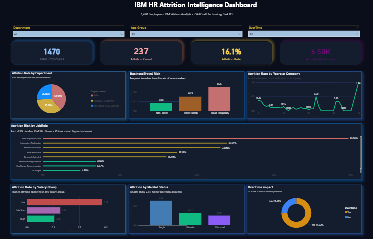
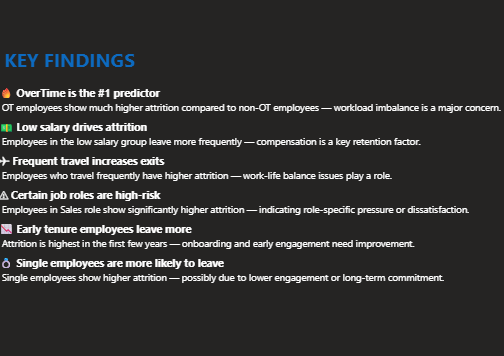

# HR Employee Attrition Analytics Dashboard

## Project Executive Summary
Developed as the **third milestone** of my Data Analyst Internship at SkillCraft Technology, this project utilizes the IBM HR Employee Attrition dataset to uncover critical workforce trends. By engineering an interactive Power BI dashboard, I transformed raw human resources data into a strategic tool that identifies turnover drivers, high-risk departments, and demographic patterns to support data-driven retention strategies.

---

## Visual Reports

### 1. Main Overview Dashboard

*The primary dashboard provides a high-level summary of KPIs including Attrition Rate, Total Employee Count, and Average Age.*

### 2. Detailed Trend Analysis & Insights

*This view deep-dives into specific correlations between Job Roles, Age Groups, and Satisfaction levels to pinpoint where intervention is most needed.*

---

## Technical Workflow

### 1. Data Transformation (Power Query)
* **ETL Process:** Cleaned and standardized 1,470 employee records to ensure analytical accuracy and data integrity.
* **Feature Engineering:** Developed conditional columns for **Age Groups** (Below 25, 25-34, 35-44, 45-54, 55+) to identify generational attrition risks.

### 2. Analytical Modeling (DAX)
Utilized **Data Analysis Expressions (DAX)** to create dynamic measures for real-time reporting:
* **Attrition Rate:** Calculated as (Total Attrition / Total Employees) to benchmark turnover.
* **Workforce Metrics:** Real-time counts for Total Employees, Attrition Count, and Average Age.
* **Responsive Filtering:** Engineered measures to respond accurately to cross-filtering across all visual elements.

### 3. Visualization and Design
* **KPI Metrics:** Integrated high-level cards for immediate situational awareness of workforce health.
* **Workforce Segmentation:** Implemented bar charts and tree maps to visualize attrition by Department (Sales, R&D, HR) and Job Roles.
* **Demographic Breakdown:** Visualized the correlation between employee age groups and attrition volume.

---

## Strategic Business Insights

* **Departmental Hotspots:** The **Sales** department shows a higher attrition rate compared to R&D, indicating a potential need for review in incentive structures or management styles.
* **Critical Age Segment:** Employees in the **25-34 age group** represent the highest volume of departures, highlighting the need for enhanced early-career engagement programs.
* **Role-Specific Turnover:** Identified Laboratory Technicians and Sales Executives as the roles with the highest turnover frequency.
* **Retention Opportunity:** Analysis suggests that workforce stability is closely tied to specific job roles and satisfaction levels, providing a clear roadmap for targeted HR interventions.

---

## Repository Structure
* `HR Employee Attrition Analysis/data/`: Contains the IBM HR Employee Attrition CSV dataset.
* `HR Employee Attrition Analysis/images/`: High-resolution screenshots (`dashboard.png` and `insight.png`).
* `HR Attrition Dashboard.pbix`: The source Power BI file for full interactivity.
* `README.md`: Project documentation and executive summary.

---

## Contact and Collaboration
I am committed to leveraging data to drive strategic organizational growth. Having completed multiple analytical milestones during my internship at SkillCraft Technology, I am eager to apply these insights to complex business challenges. Let's connect to discuss data strategy or future opportunities.

[LinkedIn Profile](https://www.linkedin.com/in/avanivv) | [GitHub Profile](https://github.com/avanivv1013)

---
*Internship Task #3 - SkillCraft Technology*
